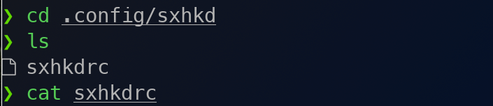
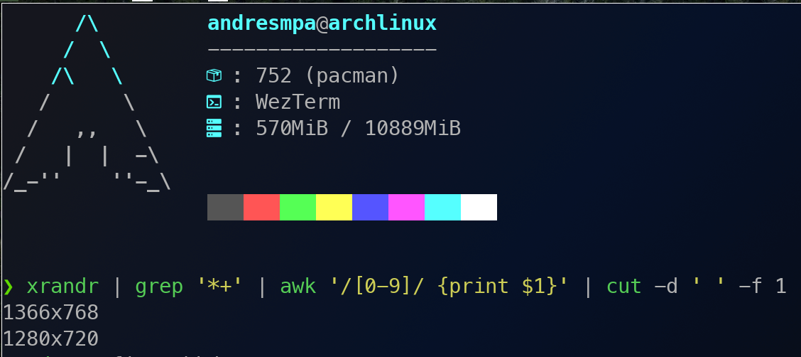
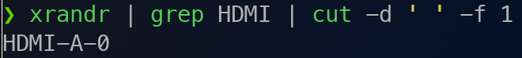
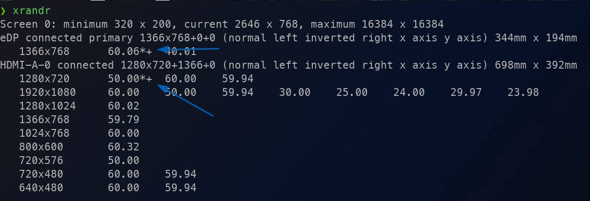
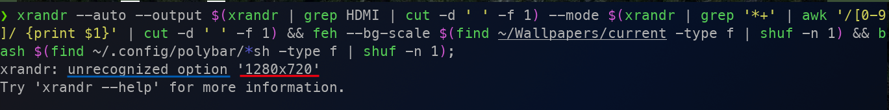
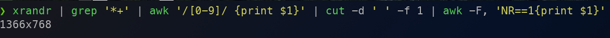
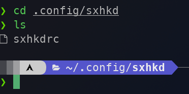

# Bash como la espada del Talión

### El problema

La segunda pantalla, en donde llevo mis reuniones y que utilizo para monitoriar grabaciones y así; se ve mal pues la resolución de la misma es de la misma no hace match con el output de mi PC

| Caracteristica  | Datos          |
| --------------- | -------------- |
| Tiempo estimado | 1 hora         |
| PF              | 3              |
| Lenguaje        | Bash script    |
| OS              | Arch Linux x64 |
| Daemon trigger  | sxhkd          |
| Tipo de tarea   | Mantenimiento  |

El primer paso será ubicar el archivo que contiene los scripts pre existentes



Script pre existente:

```bash
xrandr --auto --output $(xrandr | grep HDMI | cut -d ' ' -f 1) --mode $(xrandr | grep '*+' | awk '/[0-9]/ {print $1}' | cut -d ' ' -f 1) && feh --bg-scale $(find ~/Wallpapers/current -type f | shuf -n 1) &&	bash $(find ~/.config/polybar/*sh -type f | shuf -n 1);
```

Si se analiza el script lo que va despúes de "--mode" es la sección del comando que me indica la resolución que debe de tomar la segunda pantalla:



Si vemos el comando que determina la segunda pantalla

```bash
xrandr | grep HDMI | cut -d ' ' -f 1
```



Vemos que el output es una única linea del standart output, esa única linea representa ese segundo monitor contectado por HDMI

Si vemos que ese standart output solo soportar una linea como respuesta a "--mode" pero realmente la expresión regular arroja 2 coincidencias entendemos rapidamente el porque del error, la instrucción `grep '*+'` determina 2 resultados



Esto hace que al usar el script completo y tener 2 opciones de resolución para "--mode" la segunda opción genere:



Puesto que lo que entiende este comando de una sola linea es algo así como:

```bash
1366x768\n
          1280x720
```

Lo cual no es una opción posible

Ya la solución se hace sencilla de lograr, para esto podemos usar una expresión regular o "regrex" a traves del comando `awk` que corta directamente sobre el estadar output, para ello podemos usar el pipeline simple



La función del comando `cut -d ' ' -f 1 | awk -F, 'NR==1{print $1}'` es cortar sobre la salida para eliminar la resolución de "1280x720" esa resolución ya que esa resolución no hace match con el tamaño de la pantalla

Para arreglarlo finalmente hay que dirigirse al archivo que tiene los scripts y editarlo:



Simplemente se ha de cambiar el srcipt anterior por la nueva forma en la que se hará, usando la solución encontrada:

```bash
xrandr --auto --output $(xrandr | grep HDMI | cut -d ' ' -f 1) --mode $(xrandr | grep '*+' | awk '/[0-9]/ {print $1}' | cut -d ' ' -f 1 | awk -F, 'NR==1{print $1}') && feh --bg-scale $(find ~/Wallpapers/current -type f | shuf -n 1) &&	bash $(find ~/.config/polybar/*sh -type f | shuf -n 1);
```
