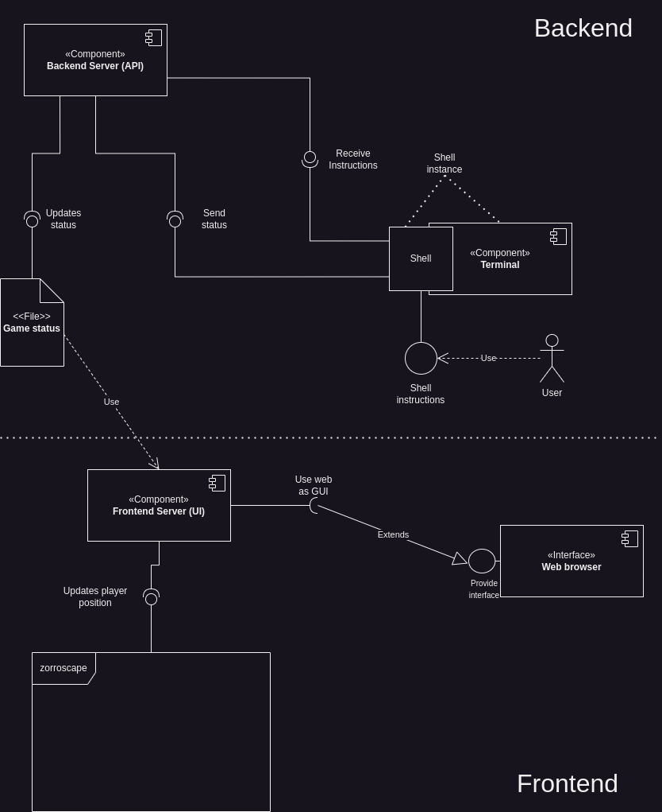
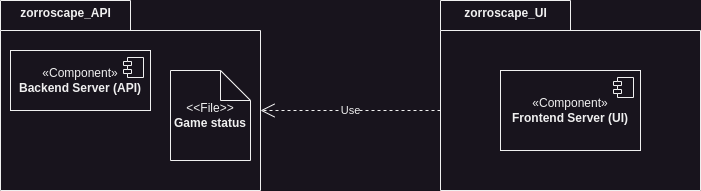
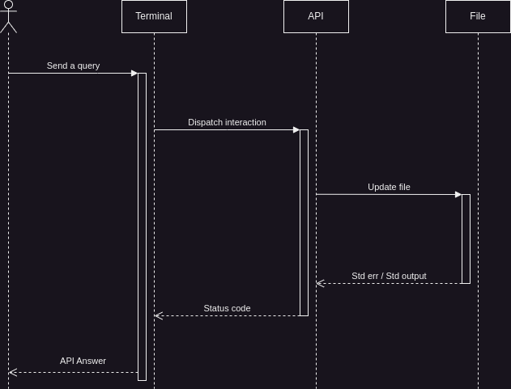
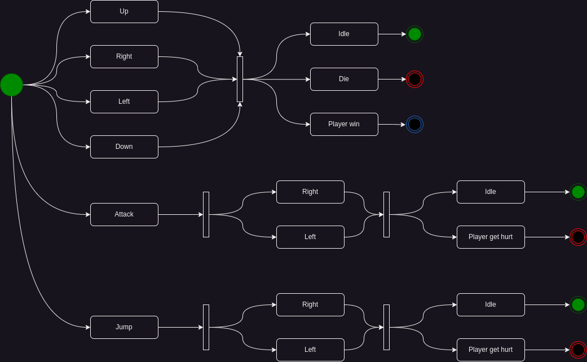

# Assigments #1

## A qué no puedes hacer esto antes de la siguiente clase 👀:

- Con tu cuenta de GitHub, crea un repósitorio y genera un "merge conflict" 😭, documenta el proceso para generarlo 🗒️ y la forma en la que lo solucionaste ✔️

- Genera al menos 3 ramas y crea commits diferentes en cada una 😱 hasta que el árbol de git se vea muy adelantado (Como con la imagen de las features) 👈🏻 En una de las ramas, has un merge y muéstranos como quedó ese árbol 🌳

### Reto extra

- ¿Muy fácil? Reto extra 🌱 usa 2 repositorios diferentes para almacenar el mismo código. ¿Fuiste la primera persona? 🏆 Quien lo haga primero se gana una asesoría de carrera con nuestro instructor 🏆

# Assignment #2

Contexto 🌲: En un aplicación web 👀 se quiere agregar un componente, ese componente debe ser interactivo con el usuario y unos de datos (Ignorando específicamente que sean esos datos) 👈🏻

Objetivo 🎯: Pensar en un componente 🧠 puede ser de cualquier tipo (ML, AI, Bolitas interactivas, representante de algo, lo que se les ocurra, etcétera). Una vez tengan una anoten el contexto ✍️ con esa descripción creen:

- Un diagrama de flujo 🍃, de como consideran que irían sus datos desde una arquitectura simple de Frontend (Interfaz), Backend (Esa cosa que hace cálculos) y base de datos (La cosa que guarda la información).

- Un diagrama de paquetes 📦, en dónde muestren como dividirían su aplicación.

- Usen al menos 3 👈🏻 diagramas diferentes (Si es mucho) de la lista que hay en el recurso: https://diagramasuml.com/ para modelar su funcionalidad ✅

Reto extra ☺️

- Si hacen esto bien 👏🏻, se van a dar cuenta de que no todos los diagramas les sirven para modelar funcionalidades chiquitas 👁. La primera persona que me diga cuáles son, 🏆 obtendra un premio secreto 🏆

# Assignment #3

Contexto 🌲: Hay muchas arquitecturas de software que me sirven para llamar, invocar o usar una funcionalidad de otro lenguaje 🐜 una de esas formas la vimos en la sesión de hace unos días, por lo que hay que practicarlo 💪🏻

Objetivo 🎯: Hacer un ejemplo de implementación basándose en UML 👁️

Tener en cuenta 🚨: La idea de esta práctica es poder usar 2 archivos para lograr una funcionalidad tan grande como quieras (Puede ser solo imprimir un texto)

Nota: Hay 2 maneras de hacer esto, hacerlo bien o hacerlo mal.

- Haciéndolo mal ❌: Haces primero el código y luego haces el UML

- Haciendo bien ✔️: Haces primero el UML y luego el código

# Assignment #4

# Assignment #5

Crear una tabla llamada "example" dentro de alguna base de datos 🌲

# Assignment #6

Esta vez no puedo saber si lo hacen o no 👁, pero la tarea de esta vez será revisar todos los ejemplos de [JS by examples](https://javascriptbyexample.com/) 🌲

# Assignment #7

Espero que hayan entendido lo que les he venido explicado 🌱, eventualmente veremos cositas más interesantes y cositas más útiles 👀

Para esta ocasión la idea será pensar un poquito en carpetas 📂 la idea será crear lo siguiente:

🌲 Crear una carpeta de rutas en donde puedas partir las rutas 🪓

🌲 Usar archivos index.js con los cuales puedes invocar solo la carpeta sin invocar el archivo especifico 🗝

🌲 Formatear todo el API para crear tantas carpetas como consideres que sean necesarios 🤔

🌲 Has que tu API funcione 🏁

Opcional:

🍃 Usar otro lenguaje en lugar de bash, para esto solo hay que reemplazar la expresión exec

Restricciones:

❌ No muevas los archivos: .env, index.js, package.json packages-lock.json

# Assignment #8

Usualmente alguien más nos entrega los tickets, pero realmente es bueno saber como se hacen, por ende la idea de este assigment es que escriban uno. Idealmente que sea sobre software (Los quiero pero no me gustaría saber la historia de sus ex)

🌲 Usando como referencia el ticket que ya les mostré 👀 cree un ticket que tenga una descripción del problema y la respectiva tablita con datos de la dificultad y demás 📊 Todo usando markdown, por supuesto 🏁

🌲 Hay que usar un método de estimación para determinar cuanto tiempo nos vamos a tardar ⏳, para eso Robert C. Martin nos recomienda el método de estimación a 3 factores. Ya que Uncle Bob es como Jesucristo, le haremos caso 🍃

Opcional:

🍃 Describir la solución a la que llegaste

# Assignment #9

Lo qué más hace la/el dev promedio es agregar codigo a un software existente, por ende aprender a agregar piezas de código o funcionalidades a un código existente es muy importante (Sobre todo si ese código es tuyo). Para este assignment debes de cumplir lo siguiente:

🌲 Agregar la funcionalidad de actualizar un archivo usando una clase genérica (FileService) y una clase específica (ExampleService) 🏁

🌲 Conecta los endpoints y los servicios (Usando ExampleService)

🌲 Conecta los servicios entre si (Usando this)

🌲 Formatea la respuesta es res para que sea de tipo JSON

Opcional:

🍃 Agregar documentación de a tus endpoints

🍃 Agregar un método patch que haga lo mismo que put, con la diferencia de que permita agregar datos, no reescribir todo el archivo 🤔

Restricciones:

❌ Usar los métodos del servicio FileService para todo esto

# Assigment #10

Vamos a retomar cositas de planificación antes de irnos de lleno a la codificación 🌲 Hay 2 formas de hacer esto, cumplir porque si o ayudarte a ti mism@ para el futuro 💫, la idea será la siguiente:

Tomando los 4 diagramas de más abajo 🗺 debes de construir un "plan" de trabajo, para eso has de escribir todos los tickets 🎟 que encuentres entre los diagramas. Ten en cuenta que yo estimo unos 15, pero puede que tú encuentres más o menos 👍 no hay lío si te salen 20 u 8, el reto de esto es identificar las tareas que se necesitan 🎯

